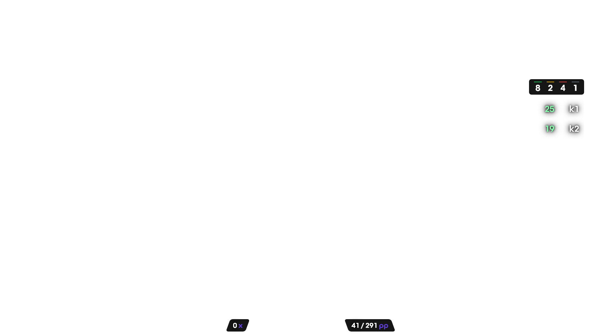

# Simple Overlay for Gosumemory pp counter
### This is a custom skin for the Gosumemory pp counter
### (https://github.com/l3lackShark/gosumemory).

<br>

# Preview
## Song Select

## In Game


<br>

# Installation
### Simply download the zip file and extract it to your Gosumemory static folder.
### Change your config.ini to use this skin
```ini
[GameOverlay]
enabled = true
gameWidth = 1920
gameHeight = 1080
overlayURL = http://localhost:24050/SimpleOverlay
overlayWidth = 1920
overlayHeight = 1080
overlayOffsetX =0
overlayOffsetY =0
overlayScale =10
```
### You can adjust the scale or dimensions to fit your screen
### Restart Osu! to apply the changes (if nothing's changed, try restart both Gosumemory and Osu!)